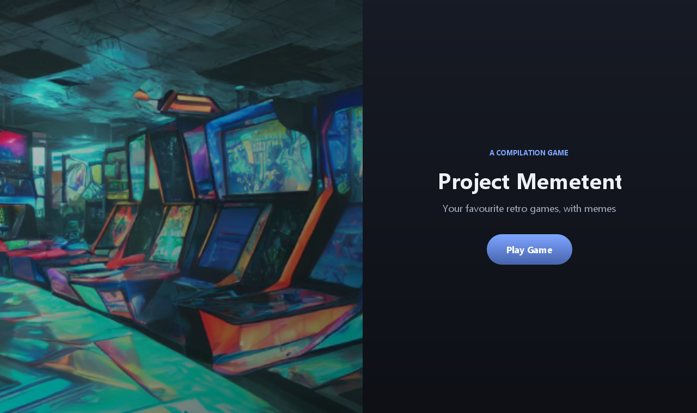
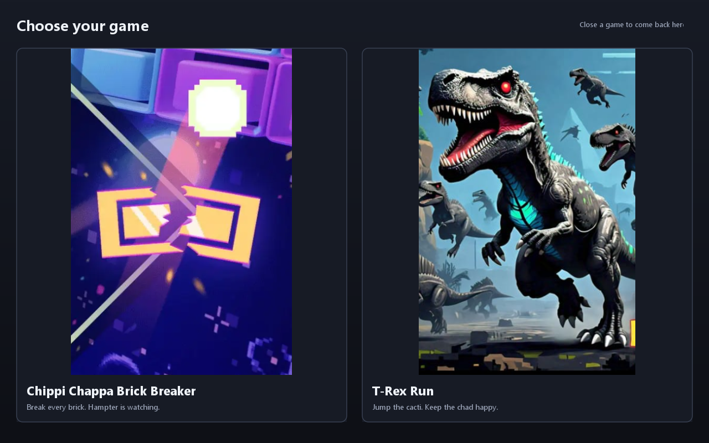
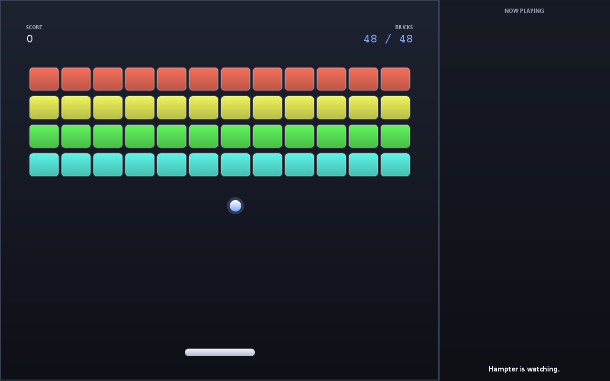
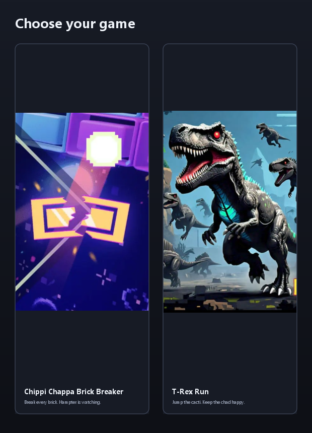

# Project Memetent

Two retro games with memes, in Java Swing: **Chippi Chappa Brick Breaker** and **T-Rex Run**.



| | |
|---|---|
|  |  |

## Running it

Requires **JDK 21+** (set `JAVA_HOME`, or have `java`/`javac` on your PATH).

```powershell
./run.ps1                 # compile and open the menu
./run.ps1 -Screen brick   # jump straight to brick breaker
./run.ps1 -Screen dino    # jump straight to T-Rex run
./run.ps1 -Test           # headless layout checks, no window
```

### Controls

| Game | Keys |
|---|---|
| Brick breaker | `←` `→` or `A` `D` to move, `Space`/`Enter` to serve and restart |
| T-Rex run | `Space`, `↑` or `W` to jump and restart |

Closing a game returns you to the picker rather than quitting, so one machine can be handed
from player to player.

## Shipping it to an audience

`build.ps1` produces a **self-contained Windows app with its own Java runtime**. Whoever you
give it to double-clicks and plays — no Java install, no command line, no setup.

```powershell
./build.ps1              # portable app -> package/Project Memetent/
./build.ps1 -Installer   # additionally build a .exe installer (needs WiX, see below)
```

The build refuses to package if the layout checks fail, and afterwards verifies that the
packaged app can find all 18 of its media files while running from an unrelated working
directory.

### Which format to hand out

| Format | How they get it | Notes |
|---|---|---|
| **Portable folder** (default) | Zip `package/Project Memetent/`, share the zip | ~96 MB, ~50 MB zipped. No admin rights, runs from anywhere including a USB stick. Easiest. |
| **Installer** (`-Installer`) | Send the `.exe` | Start-menu entry and a real uninstaller — the most polished option. Needs [WiX Toolset v3](https://github.com/wixtoolset/wix3/releases) on PATH at build time. |

If you are putting it on GitHub Releases, attach the zip: the browser download works
everywhere and needs no explanation.

Two things worth knowing before you hand it out:

- **It is unsigned.** Windows SmartScreen will show "Windows protected your PC" on first
  run, and the user has to click *More info → Run anyway*. Warn them, or buy a code-signing
  certificate if this is going somewhere public.
- **It is Windows-only as configured.** `jpackage` builds for the platform it runs on, so a
  Mac or Linux build has to be produced on that platform. The code itself is portable.

### Why the build is not just "copy everything"

The repo is much larger than the game needs. `build.ps1` stages assets from an explicit
manifest, which leaves behind ~18 MB of audio no code references (`hamasteroirignl.mp3`,
`chippioriginal.mp3`), an unused PSD, and an unused 1.2 MB PNG. `tools/OptimizeAssets` then
downscales the meme GIFs from 640px to the 420px the side rail actually renders at, taking
them from 72.7 MB to 23.8 MB. Originals stay untouched in git — only the packaged copies are
optimized.

`jlink` trims the bundled runtime to the modules a Swing app needs, which is the difference
between a 173 MB and a 96 MB app.

## Layout and responsiveness

Every screen re-flows with its window rather than assuming a fixed size:

| Screen | Behaviour |
|---|---|
| Landing | Hero image drops below 820px, copy takes the full width |
| Picker | Cards stack vertically below 760px; the header hint hides below 780px |
| Brick breaker | Field geometry is a fraction of the panel; meme rail collapses below 900px |
| T-Rex run | Ground, dino and cacti all scale and reposition with the panel; rail collapses below 880px |



`RatioSplit` handles the proportional splitting and the collapse breakpoints. `Theme` holds
the palette and a type scale that tracks panel width.

### Checking it

```powershell
./run.ps1 -Test    # 64 assertions across 9 window sizes, including portrait
```

`tools/LayoutSmokeTest` paints every screen headless from 480x360 up to 2560x1440 and asserts
the moving parts stay inside their panel and that the dino's ground line tracks the panel
height. That last one is the regression guard for the bug this rewrite was mostly about:
geometry captured once at construction and never updated.

`tools/RenderScreens` writes the `screenshots/` images above, which is the fastest way to
review a layout change without resizing four windows by hand.

## Layout

```
FirstPage / GameStartupPage    menu screens
BrickBreakerWindow / Gameplay  brick breaker
UserInterface / GamePanel      T-Rex run
components/                    dino world: Ground, Dino, Obstacles, Sky
utility/Assets                 media resolution and caching
Theme, RatioSplit, MemeRail    shared UI foundation
tools/                         smoke test, screenshot renderer, asset optimizer
shim/                          MP3Player reimplemented on JLayer
```

`shim/` exists because the original `jaco-mp3-player` jar the code was written against is no
longer distributed anywhere. The shim reimplements the slice of its API the games use on top
of [JLayer](http://www.javazoom.net/javalayer/javalayer.html), which is on Maven Central.
